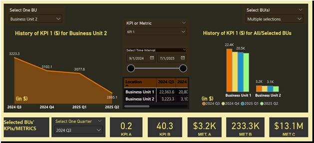

# 🧠 Power BI Office Space Utilization Dashboard
## About This Project
This Power BI project was developed as part of a space utilization analytics initiative.  
It demonstrates end-to-end dashboard design — from data preparation to visualization and storytelling.

> **Disclaimer:** All data presented are fictitious and created solely for demonstrating Power BI visualization and analytical capabilities.
> They do not represent real people, companies, or organizational data.
## 📊 Introduction



In today’s hybrid work environment, managing and optimizing **office space utilization** is a growing challenge for organizations. Decision-makers need accurate, real-time insights into how spaces are used, which business units are under- or over-utilizing areas, and how workplace patterns evolve over time.

Recognizing this need, I designed and developed a **Power BI dashboard** that visualizes key performance indicators (KPIs) and metrics for space utilization. The dashboard provides a clear and dynamic view of how different departments perform in terms of occupancy, cost efficiency, and employee presence rates — helping leaders make informed, data-driven decisions.

---

## 🧩 Project Objectives
The goal of this project was to create a **data-driven monitoring system** that:
- Tracks and analyzes **space utilization KPIs** across multiple business units  
- Allows **interactive filtering** by time, business unit, or location  
- Highlights **historical trends and variances**  
- Enables **data-driven recommendations** for space optimization and cost reduction  

This Power BI dashboard serves as both a **management tool** and an **analytical framework**, helping corporate real estate teams identify inefficiencies and predict future needs.

---

## ❗ Problem Statement
Traditional reporting tools offered only static, one-dimensional insights that quickly became outdated.  
The main challenges were:
- Fragmented data sources and inconsistent formats  
- Manual report generation with no ability to drill down  
- Lack of visibility into **historical performance** and **trend analysis**  
- Inability to compare multiple **business units or time periods** dynamically  

My mission was to **transform static data into an interactive, automated visualization system** that updates in real time and adapts to user selections.

---

## ⚙️ Methodology

### 1. **Data Collection and Preparation**
Collected data from internal databases, spreadsheets, and occupancy systems.  
Performed **data cleaning**, normalization, and validation in Power Query to ensure consistency across all metrics (e.g., cost per RSF, occupancy rate, employee attendance).

### 2. **Data Modeling**
Created a **relational data model** that connected multiple tables — including location, business unit, KPIs, and historical data — ensuring one-to-many relationships were properly configured for accurate DAX measures.

### 3. **DAX Development**
Developed several **DAX formulas** to calculate:
- Occupancy and vacancy rates  
- Cost and RSF  related Metrics and KPIs
- Employee-in-office percentages Metrics and KPIs
- Dynamic chart units, titles and KPI labels  

This required advanced use of `SELECTEDVALUE`, `SWITCH`, and `CALCULATE` to make metrics respond instantly to slicer interactions.

> **Example:**  
> The `2-PG1 CHART units` measure dynamically adjusts the suffix (%, $, RSF) displayed in chart titles depending on the selected KPI.

### 4. **Visualization and Design**
Designed the dashboard using **Power BI’s modern visual storytelling approach**, focusing on:
- Clean layout and minimal design  
- Consistent color schemes for readability  
- KPI cards for executive summary  
- Interactive slicers for time, location, and business unit filters  
- Drill-through pages for detailed department-level analysis  


### 5. **Interactivity & Dynamic Titles**
Implemented **dynamic page titles and metrics** that change based on user selection — providing clear context for what data is being displayed.

### 6. **Historical Trend Analysis**
Included historical data views to analyze occupancy rate, cost trends, and headcount distribution over time, helping stakeholders track changes and forecast needs.

---

## 🧠 What I Did
This project was a complete end-to-end data visualization development process that included:
- Designed **data architecture and relationships**  
- Created and cleaned datasets using **Power Query**  
- Wrote **DAX measures** for dynamic KPIs and visual behavior  
- Developed **custom visuals** and layout design  
- Implemented **interactive slicers**, **buttons**, and **bookmarks** for intuitive navigation  
- Validated calculations and tested interactivity with real user scenarios  

---

## 📚 What I Learned
Throughout this project, I deepened my understanding of how **data visualization impacts decision-making** and learned several technical and analytical lessons:

### Technical Lessons
- How to **optimize DAX performance** with calculated columns vs. measures  
- Best practices for **data modeling** (star schema, normalization, and relationships)  
- Importance of **context transition** in DAX (especially when using `CALCULATE`)  
- How to build **scalable dashboards** that can adapt to additional KPIs or datasets  

### Business & Design Lessons
- The importance of **user-centric design** — dashboards must be intuitive, not just technically advanced  
- How clear data storytelling drives better engagement from business users  
- How dynamic insights can transform a reporting tool into a **strategic decision-making platform**

---

## 🧰 Tools & Technologies
| Tool | Purpose |
|------|----------|
| **Power BI** | Dashboard development & data visualization |
| **Power Query** | ETL (Extract, Transform, Load) for data preparation |
| **DAX (Data Analysis Expressions)** | Custom measures, KPIs, and logic |
| **Excel / SQL Data Sources** | Data input and integration |
| **Git and GitHub** | Version control and project documentation |

---

## 📈 Key Features
✅ Dynamic KPIs with real-time data updates  
✅ Interactive slicers and filters  
✅ Historical trend analysis  
✅ Clean and modern layout design  
✅ Drill-through functionality for deeper exploration  
✅ Fully documented DAX logic and data modeling  

---

## 🧮 Sample DAX Codes


```DAX
1️⃣ Dynamic Unit Display
CHART units =
VAR SelectedDisplayName = SELECTEDVALUE('2-Display Name Table'[Display Name], " ")
VAR SelectedMetric = CALCULATE(
    FIRSTNONBLANK('2-Display Name Table'[Variable1], ""),
    '2-Display Name Table'[Display Name] = SelectedDisplayName
)
VAR Suffix =
    SWITCH(
        SelectedMetric,
        "VAR1", " $",
        "VAR2", " %",
        "VAR3", " RSF",
        ""
    )
RETURN
IF(Suffix = "", "", "(in " & Suffix & ")")

2️⃣ Dynamic Page Title
DynamicTitle =
VAR SelectedLocation = SELECTEDVALUE('Append2'[Location], "All Locations")
VAR SelectedMonth = SELECTEDVALUE('Append2'[Formatted Month], "All Months")
RETURN SelectedLocation

3️⃣ Dynamic KPI Aggregation
Selected MULTIPLE DISPLAY KPI/Metric APPEND2 =
VAR SelectedDisplayNames = VALUES('2-Display Name Table'[Display Name])
VAR ActualKPINames =
    CALCULATETABLE(
        VALUES('2-Display Name Table'[KPI Append2 Name]),
        '2-Display Name Table'[Display Name] IN SelectedDisplayNames
    )
RETURN
CALCULATE(
    SUM(Append2[KPI/METRICS VALUES]),
    'Append2'[KPI/METRIC NAME] IN ActualKPINames
)
```


## 🌍 Future Improvements
- Integrate with SQL Server or Azure Data Warehouse for real-time refresh  
- Add Power Automate workflows for notifications or report delivery  
- Incorporate forecasting models using Power BI’s AI visuals  
- Expand to include financial KPIs (e.g., cost per headcount, budget variance)

## 🏁 Conclusion
This Power BI project demonstrates how raw operational data can be transformed into a strategic insight platform.  
It shows that well-designed dashboards go beyond visualization — they tell a story, reveal hidden opportunities, and guide smarter decisions.
# POWER_BI_DASHBOARDS

